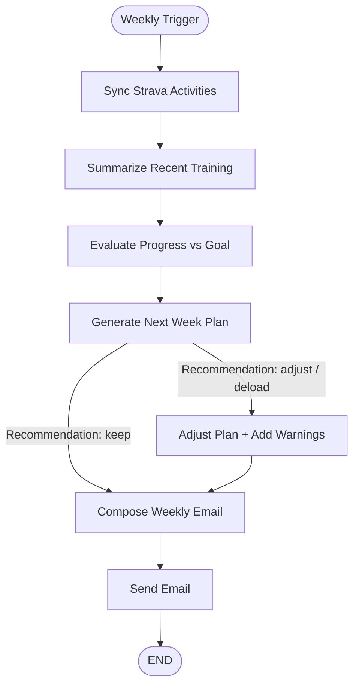

# Strava Training Agent (LangGraph)

Weekly Strava training assistant that fetches activities, summarizes progress, generates a next-week plan with an LLM, and emails (or previews) the plan.

## Setup

1. Create/activate venv (optional):
   - `python3 -m venv env && source env/bin/activate`
2. Install deps:
   - `pip install langgraph langchain-openai langchain-core python-dotenv requests`
3. Configure environment in `.env` (or export):
   - Strava: `STRAVA_CLIENT_ID`, `STRAVA_CLIENT_SECRET`, `STRAVA_REFRESH_TOKEN` (auto-refreshes access token), optional `STRAVA_ACCESS_TOKEN`
   - OpenAI: `OPENAI_API_KEY`
   - Email (optional; previews if unset): `SMTP_HOST`, `SMTP_PORT`, `SMTP_USERNAME`, `SMTP_PASSWORD`, `SMTP_SENDER`, `RECIPIENT_EMAIL`
   - Goal override: `TRAINING_GOAL_RACE`, `TRAINING_GOAL_DATE`, `TRAINING_GOAL_DISTANCE_KM`, `TRAINING_GOAL_ELEVATION_GAIN_M` (or `TRAINING_GOAL_JSON` as a fallback)
   - Other: `SESSIONS_PER_WEEK` (default 3), `TRAINING_AGENT_LOG` (default `logs/training_agent.log`), `TRAINING_AGENT_STATE_LOG` (default `logs/state_snapshots.log`)

## Run

```
python strava_training_agent.py
```

Behavior:

- Fetches Strava activities (auto-refresh token if creds present).
- Summarizes recent training and generates a plan (in km) via LLM.
- Adjusts plan if risks flagged, composes email, then:
  - Sends via SMTP when configured.
- Otherwise prints and logs the email preview.
- Renders `my_graph.png` (Mermaid) on each run.

## Automatic weekly runs (GitHub Actions)

- A ready-to-use workflow is provided in `.github/workflows/weekly-agent.yml`.
- It runs every Monday at 07:00 UTC (and can be triggered manually).
- Configure secrets in your repo settings:
  - `STRAVA_CLIENT_ID`, `STRAVA_CLIENT_SECRET`, `STRAVA_REFRESH_TOKEN`
  - `OPENAI_API_KEY`
  - Optional SMTP (AWS SES or other): `SMTP_HOST`, `SMTP_PORT`, `SMTP_USERNAME`, `SMTP_PASSWORD`, `SMTP_SENDER`, `RECIPIENT_EMAIL`
  - Optional goal override: set discrete vars (`TRAINING_GOAL_RACE`, `TRAINING_GOAL_DATE`, `TRAINING_GOAL_DISTANCE_KM`, `TRAINING_GOAL_ELEVATION_GAIN_M`) or use `TRAINING_GOAL_JSON`
- The workflow checks out the repo, sets up Python, installs deps, and runs `python strava_training_agent.py`.

### AWS SES SMTP quick setup (optional)

- In SES, create SMTP credentials and a verified sender (domain or email).
- Use these values:
  - `SMTP_HOST`: e.g., `email-smtp.us-east-1.amazonaws.com`
  - `SMTP_PORT`: `587` (or `465` if you prefer SSL)
  - `SMTP_USERNAME`: SMTP username from SES console
  - `SMTP_PASSWORD`: SMTP password from SES console
  - `SMTP_SENDER`: verified email/domain in SES
  - `RECIPIENT_EMAIL`: your destination email
- Add the SMTP values to GitHub Actions Secrets (or `.env` locally). If omitted, emails are previewed in logs/console instead of sent.

## Logging

- Main log: `logs/training_agent.log` (set `TRAINING_AGENT_LOG` to override).
- State snapshots: `logs/state_snapshots.log` (set `TRAINING_AGENT_STATE_LOG`).
- LLM requests/responses and Strava payloads are logged with truncation safeguards.

## Graph overview

- Nodes: sync_strava_activities → summarize_recent_training → evaluate_progress_vs_goal → generate_next_week_plan → (conditional: keep → compose_weekly_email, adjust/deload → adjust_plan_add_warnings → compose_weekly_email) → send_email → END.
- Graph image saved as `my_graph.png` each run.
- Preview (generated): ``
- Diagram source (mermaid): see `diagram.md`
 - Diagram preview:

````markdown

````
