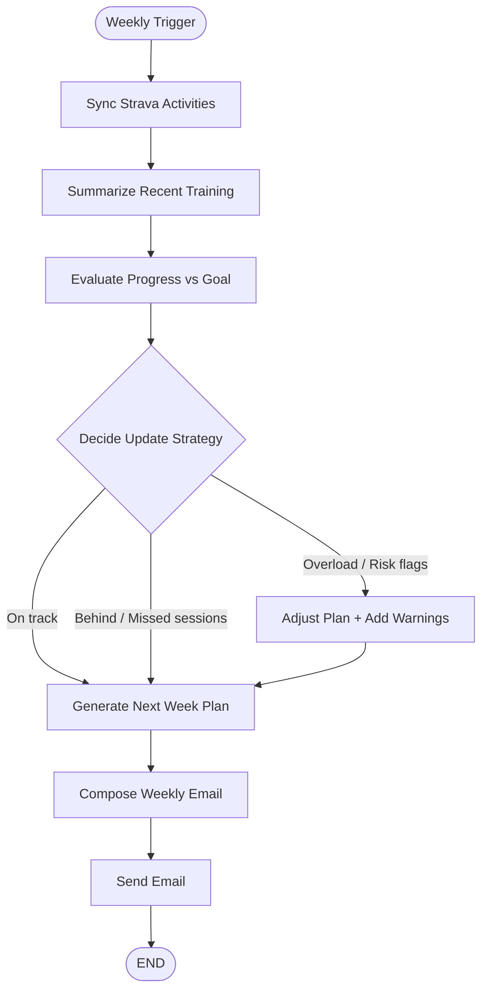

```mermaid
flowchart TD
  A([Weekly Trigger]) --> B[Sync Strava Activities]
  B --> C[Summarize Recent Training]
  C --> D[Evaluate Progress vs Goal]
  D --> E{Decide Update Strategy}

  E -->|On track| F[Generate Next Week Plan]
  E -->|Behind / Missed sessions| F
  E -->|Overload / Risk flags| G[Adjust Plan + Add Warnings]
  G --> F

  F --> H[Compose Weekly Email]
  H --> I[Send Email]
  I --> J([END])
```
