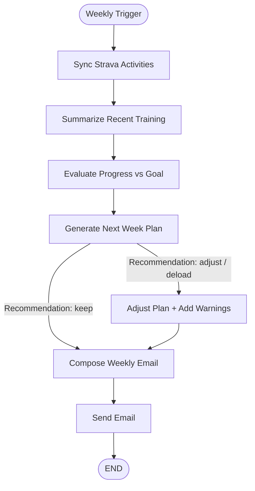

```mermaid
flowchart TD
  A([Weekly Trigger]) --> B[Sync Strava Activities]
  B --> C[Summarize Recent Training]
  C --> D[Evaluate Progress vs Goal]
  D --> E[Generate Next Week Plan]

  E -->|Recommendation: keep| H[Compose Weekly Email]
  E -->|Recommendation: adjust / deload| F[Adjust Plan + Add Warnings]
  F --> H

  H --> I[Send Email]
  I --> J([END])
```
